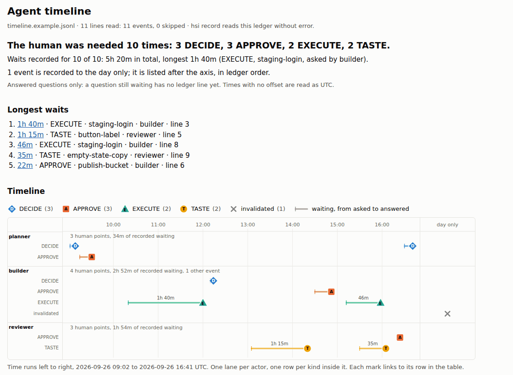

# hsi-operator

A skill that keeps a human at the strategic level of agent work.

Agents are good at producing things and bad at knowing whether anyone wanted them. This
is the other half: **surface only what genuinely needs a person, and find out what "done"
means before building.**

## Start here

This is the one repo to point an agent at. Give it the link and say "read AGENTS.md":
`https://github.com/rivendale/hsi-operator`. It routes to the sibling repo the task needs.
Each sibling is maintained separately and links back here.

| when the task is | read |
|---|---|
| keeping a person at the strategic level of agent work: what needs them, what done means | this repo |
| data that may never reach a hosted model; local models and runtimes, private search, finding personal information | [local-ai](https://github.com/rivendale/local-ai) |
| building from open source instead of from scratch; what a license lets you reuse | [opensource](https://github.com/rivendale/opensource) |
| running services on your own machines: WSL, systemd user services, networking, sync and backup, alerting | [homelab](https://github.com/rivendale/homelab) |

The same facts for a program are in [`repos.json`](repos.json). `evals/siblings/` fails CI when
this page or `AGENTS.md` stops linking a sibling, or a sibling stops linking back.

## Skills

Four skills. The first has two doors:

**`hsi-operator`**
- **`how can I help`** — the 3 things that most need you, each as an answerable question
- **`what does done mean`** — acceptance criteria, elicited *before* work starts

**`repo-triage`** — when someone shares a repo, model or tool and asks "is this useful?",
evaluate it against **measured** gaps rather than its own pitch. Most verdicts should be
no. The failure it prevents is adopting on enthusiasm, and its order is deliberate:
license first because it is the cheapest kill, then maturity, then **does the runtime exist
on the hardware you actually have** — the check most often skipped and the one that kills
most confidently.

```
triage owner/repo            license, age, activity — the mechanical half
triage --hf org/model        same for a Hugging Face model
```

It answers steps 1 and 2 and says so. Whether the thing is *useful* is judgement, and the
tool does not pretend to have made it.

**`context-steward`** — when a long session nears its context limit, decide what must survive,
write it somewhere durable *before* the window closes, and keep working memory small by moving
detail **out** rather than summarizing it **away**. A summary is a pointer, not a substitute: it
drops the file path, the exact error and the number, and it drops them silently. Includes the
gauge rule that prompted it — check the actual context meter, not a token budget, and act at 80%
rather than 95%.

**`system-map`**: when you have lost track of how a system actually works, map it. One
app, many repos, or the infrastructure under them; a web app, a game or an operating
system. It finds every trigger first (user actions, webhooks, schedules, queues, inbound
email, agent tools, outside updates), then follows each one through the parts and stores
it touches to what a person sees at the end. It also finds the feedback loops and says
which hold steady and which are running away. The output is a model where every box,
arrow and loop cites a file and line or a dated live check, and one HTML map you can zoom
from the whole system of systems down to a single route, play a trigger step by step on, and
overlay with loops.

A map is a measurement, so it is half of a loop. Door 2's setpoint says what the system
should do, the map measures what it does, and the difference becomes drift: built but
never intended, intended but missing, or running away. `sysmap items` turns drift into
DECIDE items that `hsi` ranks with everything else, and re-mapping after a change is the
feedback.

```
sysmap check system-model.json --src owner/repo=PATH   # refuses uncited, dangling or self-contradicting maps
sysmap render system-model.json -o system-map.html     # the zoomable map, one file
sysmap render system-model.json -o map.html --vendor-dir DIR  # same, with no CDN request
sysmap items system-model.json > drift-items.json      # drift as questions for Door 1
sysmap diff old.json new.json                          # what left, first
sysmap selftest                                        # proves check still refuses
```

## Why three

A list of twenty-seven is a list of zero. The scarce resource is not willingness, it is
attention in one sitting. So the tool ranks and shows three — and prints the ranking rule
every time, because a hidden ranking is a judgement you cannot audit. The rest is one
keystroke away and never dropped.

## The test for what reaches a person at all

> Does the answer depend on the operator's preference, intent, risk appetite, money,
> relationships, legal exposure, or **taste**?

Yes, it is theirs. No, answer it yourself and say what you answered from. Four kinds
qualify: **DECIDE**, **APPROVE**, **EXECUTE** (only they have the hands), and **TASTE**
— which is where UI and UX belong and where they are most often mis-filed.

An item asking a person for a **fact** is a search somebody skipped.

## Install

Pinned to a commit you have read (recommended):

```
git clone https://github.com/rivendale/hsi-operator && cd hsi-operator
git checkout <commit-you-reviewed>
npx skills add . --skill '*' -g -a claude-code
```

A skill is instructions. Installing from the repository name tracks `main`, so a later push
changes what your agent does with no review on your machine. The installer copies the files,
so a later `git pull` in your clone changes nothing already installed; to move to a newer
commit, review it, check it out, and run the same install again.

Or track `main`, all four:

```
npx skills add rivendale/hsi-operator --skill '*' -g -a claude-code
```

Either way, one of them: `--skill hsi-operator`, `--skill repo-triage`, `--skill context-steward`,
`--skill system-map`.

Or, in Claude Code, as a plugin from the same pinned clone:

```
claude plugin marketplace add "$PWD"
claude plugin install hsi-operator@rivendale
```

Claude Code reads a plugin from a marketplace added as a local directory in place, so here the
checkout is the pin: moving it changes what loads at the next session start, which the `npx`
copy above does not do. Adding the marketplace as `rivendale/hsi-operator` instead tracks
`main`: each `claude plugin update hsi-operator@rivendale` takes whatever `main` holds.

Or read the `SKILL.md` you want and keep the file — each skill is one page of prose, and
the prose is the skill. `bin/hsi`, `bin/triage` and `bin/sysmap` are scripts **inside** the skills, not
commands on your PATH: after installing they sit at `~/.claude/skills/<skill>/bin/`.

## The contract

`bin/hsi` consumes plain JSON and knows nothing about your systems:

```
hsi items.json          # top 3, ranking rule stated
hsi items.json --all    # everything, grouped by kind
hsi items.json --why ID # the arithmetic for one item
hsi done setpoint.json  # Door 2 as a file; exit 2 if done has no check
hsi record --ledger .hsi/ledger.jsonl --from answer.json  # append an accountable answer
hsi timeline .hsi/ledger.jsonl -o timeline.html            # draw the ledger as one page
hsi --schema            # the full contract
```

An **adapter** turns your world into that contract. `adapters/jsonl-tasks/` is a worked one
reading a line-delimited task file; copy it and change the reader for your tracker. The skill never changes.

## The timeline

`hsi timeline LEDGER -o timeline.html` draws the ledger as one HTML page and answers one
question at a glance: **where was the human actually needed, and how long did each wait?**
One lane per actor, one row per kind inside it (DECIDE a diamond, APPROVE a square, EXECUTE a
triangle, TASTE a circle, each with its letter), and a bar from the moment a question was
asked to the moment it was answered. Past twelve actors, the smallest merge into one lane
that says how many it holds. A per-actor summary and a table of events sit below the chart,
and each mark links to its row. The table stops at 2,000 rows and says where the rest start;
a mark past that point is not a link.



That is [`examples/timeline.example.html`](examples/timeline.example.html), drawn from
[`examples/timeline.example.jsonl`](examples/timeline.example.jsonl), a synthetic afternoon.
The page is inline CSS and SVG: no script, no request, no model, and the same ledger always
gives the same bytes.

A ledger answer records the day and the kind, not who asked or when. Four optional fields
fill that in, and without them the page says "not recorded" rather than guessing: `actor`
(who asked, and so the lane), `asked_at` (when the question reached the operator), `at`
(when it was answered, finer than `date`) and `evidence` (a link). `hsi record` keeps them.

It reads leniently where `hsi record` reads strictly: a malformed line is skipped, counted
and listed, an unknown kind is shown as "other", and the page says whether `hsi record`
would accept the file. It shows answered questions only, because a question still waiting
has no ledger line yet.

## Honest limitations

- **An adapter over structured data cannot write `why_you` or `options`.** The included
  one emits a generic `why_you` and no options, which is weaker than the SKILL asks for.
  Options are the part an agent or a person adds; the adapter's job is to find candidates,
  not to frame them.
- **The ranking is deliberately simple** — four terms, printed, recomputable by hand. A
  weighting nobody can check is a weighting nobody will trust. It will be wrong sometimes;
  `--why` is how you catch it.
- **`hsi done` checks the shape of a check, not its meaning.** It refuses a done with no
  command, number or person behind it, and a few stock judgments like "looks good". It
  cannot tell a check that proves done from one that does not; a person still reads it.
- **This does not make anyone use it.** If it goes two weeks unopened, that is the finding,
  and it should be reported rather than answered with more features. That is now measured:
  `hsi answered --use FILE` records a real answer, and after fourteen days of silence the
  board is replaced by a single line saying nobody is using this. It cannot make the tool
  useful; it can stop the tool from being quietly useless.
- **`sysmap check` cannot tell whether a citation supports its claim.** It refuses a map
  with missing evidence, dangling references, a loop type that contradicts its own signs, a
  secret file cited or a credential-shaped string, and with `--src` a cited line that does
  not exist. Whether the line says what the map claims is still read by a second agent or
  a person. Static reading also misses routes built from config, feature flags and dynamic
  dispatch; a map says what it did not trace.

## The working agreement

`AGENTS.md` is how agents work in this repo: scope guard, testing, what a long context costs,
and how to talk to the person. Every harness we measured reads that filename, so there is one
file and no alias — and prove what your own tool loads rather than trusting a release note;
`AGENTS.md` has the measurements.
[`starter/`](starter) is the drop-in version for a new repo: `AGENTS.md`, a `CHANGELOG.md`
that asks for the failure behind each change, a `SETPOINT.md` for what done means, and the
one CI workflow. For a repo that already exists, the order matters more than the files —
[`docs/adopting-an-existing-repo.md`](docs/adopting-an-existing-repo.md) starts from the
three failures you actually had and says when to stop. Building your own agent harness:
[`docs/building-a-harness.md`](docs/building-a-harness.md) has where the bill actually goes,
what billing each shape implies, and what to build in from the start.

Resources for agents and for anyone building a harness: [`docs/tools.md`](docs/tools.md) is
what each of the four coding CLIs did when driven headless, dated, and
[`docs/harness-efficiency.md`](docs/harness-efficiency.md) is a checklist for making a harness
cheaper without making it worse, including the defaults a new project should start with.

Shorter pages, one idea each: [choosing effort](docs/choosing-effort.md) by what a finished task
costs; [writing a brief](docs/writing-a-brief.md) for another agent;
[trimming an instruction file](docs/trimming-an-instruction-file.md) by evidence without losing
the rules that work; [design rules for code](docs/design-rules-for-code.md), each shipped
with the check that enforces it; [testing a detector with planted defects](docs/planted-defect-evals.md);
[eval and hillclimb](docs/eval-and-hillclimb.md) with two gates a person holds (a draft until its
first run); [naming the reader](docs/every-output-needs-a-reader.md) before building the
producer; and [an overnight read-only audit](docs/read-only-audit.md) that someone reads.

## Changes

`CHANGELOG.md`, where every entry names the **failure that caused the change**. What moved
is in the diff already; why it moved is the part that does not survive anywhere else.

## Prior art and thanks

The `references/` layout and the honesty protocol are adapted from
[ferdinandobons/startup-skill](https://github.com/ferdinandobons/startup-skill) (MIT).
Different domain, same failure mode: an assistant that cheerleads every idea and one that
surfaces everything as important are the same defect wearing different clothes. Their
four-way claim labeling — Data, Estimate, Assumption, Opinion — is a genuine refinement
on the three-way version this started with, because collapsing *estimate* into *assumption*
is what lets a calculation pass as a finding.

Door 2's three paths (spike, bounded, architectural), the one-way ratchet between them, and
the rule that an approval covers the stage actually shown are adapted from the brainstorming
skill in [obra/superpowers](https://github.com/obra/superpowers) (MIT). We took the
classifier and the gate; we did not take "when in doubt take the heavier path" as a general
habit, because this skill's bias is a *smaller* done, and we did not install the collection:
its session hook re-injects itself at every startup and every compaction.

`evals/trigger/` checks that each skill's description would actually route the prompts it
claims, and `--selftest` proves the check can still fail. Both run in CI on every pull
request. The idea is from
[addyosmani/agent-skills](https://github.com/addyosmani/agent-skills) (MIT), found via
[Shubhamsaboo/awesome-llm-apps](https://github.com/Shubhamsaboo/awesome-llm-apps)
(Apache-2.0); rewritten here rather than vendored.

Human-systems integration is the other parent. What we took from NASA/DAU/Endsley, what
we refused (seven-domain matrices, learned rankers), and the restricted three-body reading
of L0 live in `skills/hsi-operator/references/hsi-se.md`. Steal patterns; do not vendor them.

The timeline's lane per actor, with a kind on every event, is an idea from
[microsoft/TinyTroupe](https://github.com/microsoft/TinyTroupe) (MIT), whose simulations print
each agent's stream with its action kind. We took the idea; no code.

The system map borrows its zoom levels from the C4 model and Backstage's catalog kinds,
its trigger vocabulary from event storming, its loop notation from causal loop diagrams,
and its control-and-feedback reading from STPA. The pattern of an agent writing a typed
model that a validator checks before anything is drawn is from
[tt-a1i/archify](https://github.com/tt-a1i/archify) (MIT), and the step-by-step flow over
a zoomable diagram is IcePanel's interaction. We took the ideas; no code.

## License

MIT.
